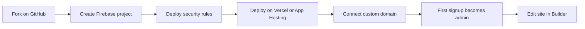

# Open Source Church Websites

An open-source website builder for Catholic parishes, inspired by eCatholic. You deploy your own copy — your parish gets its own website, its own data, and its own admin accounts. You do not share a server with other churches.

After the one-time setup below, you edit your site in the **Builder** (a visual editor in your browser). No coding is required for day-to-day updates.

## What you can do

- **Edit Website** — Add and arrange content modules (text, links, images, mass times, calendars, forms, and more)
- **Design** — Choose a theme, colors, and fonts; preview on mobile, tablet, and desktop
- **Files** — Upload pictures and documents
- **Admin** — Site settings, users, mass times, donations
- **Site Map** — Drag-and-drop navigation with unlimited pages
- **Donations** — Optional online giving through Stripe

---

## Before you start

You will need:

- A **GitHub account** — to create your parish's own copy of this project
- A **Firebase account** — stores your site content, user accounts, and uploaded files ([Firebase Console](https://console.firebase.google.com/)). The free Spark plan works for Firebase itself; **Firebase App Hosting requires the Blaze (pay-as-you-go) plan**
- A **hosting provider** — choose one:
  - **[Vercel](https://vercel.com)** — free tier available; often the simplest starting point
  - **Firebase App Hosting** — keeps everything in the Firebase Console; requires Blaze plan
- A **custom domain** (optional at first) — e.g. `www.yourparish.org`. You can test on your host's default URL first
- A **Stripe account** (optional) — only if you want online donations
- **Help with DNS** (if using a custom domain) — whoever manages your domain (GoDaddy, Namecheap, diocese IT, etc.) will need to add a few DNS records your host provides

### How setup works (overview)



**Time estimate:** Most parishes can complete setup in one afternoon with a little help on DNS and the security-rules step.

---

## Step 1 — Get your own copy on GitHub

1. Log in to [GitHub](https://github.com).
2. Open this repository in your browser.
3. Click the **Fork** button (top right) and create a fork under your account or your parish's organization.
4. You now have your parish's own copy. You do not need to install anything on your computer to deploy — both Vercel and Firebase App Hosting build directly from GitHub.

> **Note:** Updates to the main open-source project can be pulled into your fork later with help from a technical volunteer.

---

## Step 2 — Create your Firebase project

Firebase is where your website stores pages, images, user accounts, and settings. Every parish uses its **own** Firebase project.

1. Go to the [Firebase Console](https://console.firebase.google.com/) and click **Add project** (or **Create a project**).
2. Follow the prompts to name your project (e.g. "St Mary Parish Website") and finish creation.

### Enable sign-in (Authentication)

1. In the left sidebar, open **Build → Authentication**.
2. Click **Get started**, then open the **Sign-in method** tab.
3. Enable **Email/Password**.
4. Optionally enable **Google** as a second sign-in method.

### Create the database (Firestore)

1. Open **Build → Firestore Database**.
2. Click **Create database**.
3. Choose **Start in production mode** (the security rules you deploy in Step 3 will protect your data).
4. Pick a location. This project defaults to **us-west1** (Oregon) in its configuration — choose a nearby region if prompted.

### Enable file storage (Storage)

1. Open **Build → Storage**.
2. Click **Get started** and accept the default settings.

### Register your web app and copy configuration values

You will paste these values into your hosting provider in Step 4. Keep them in a notes app for now.

1. Click the **gear icon** next to "Project Overview" → **Project settings**.
2. Scroll to **Your apps** and click the **Web** icon (`</>`).
3. Register the app (any nickname is fine; Firebase Hosting is optional — skip it).
4. Firebase shows a config object. Copy each value into the matching **environment variable** name:

| Firebase Console field | Environment variable |
|------------------------|----------------------|
| `apiKey` | `NEXT_PUBLIC_FIREBASE_API_KEY` |
| `authDomain` | `NEXT_PUBLIC_FIREBASE_AUTH_DOMAIN` |
| `projectId` | `NEXT_PUBLIC_FIREBASE_PROJECT_ID` |
| `storageBucket` | `NEXT_PUBLIC_FIREBASE_STORAGE_BUCKET` |
| `messagingSenderId` | `NEXT_PUBLIC_FIREBASE_MESSAGING_SENDER_ID` |
| `appId` | `NEXT_PUBLIC_FIREBASE_APP_ID` |
| `measurementId` (optional — Analytics) | `NEXT_PUBLIC_FIREBASE_MEASUREMENT_ID` |

Save your **Project ID** (`projectId`) — you will need it in the next steps.

### If you are deploying on Vercel — create a service account

Vercel needs server-side credentials to talk to Firebase. **Skip this subsection if you chose Firebase App Hosting.**

1. In **Project settings**, open the **Service accounts** tab.
2. Click **Generate new private key** and download the JSON file.
3. From that file, copy these three values:

| JSON field | Environment variable |
|------------|----------------------|
| `project_id` | `FIREBASE_ADMIN_PROJECT_ID` |
| `client_email` | `FIREBASE_ADMIN_CLIENT_EMAIL` |
| `private_key` | `FIREBASE_ADMIN_PRIVATE_KEY` |

When pasting `FIREBASE_ADMIN_PRIVATE_KEY` into Vercel, keep the line breaks. Vercel accepts the key as one line with `\n` where each line break was in the original file.

---

## Step 3 — Deploy security rules (required)

Before your site goes live, you must deploy the security rules included in this repository. These rules ensure **only your admin users** can edit website content — not random visitors.

This is a one-time step (repeat only if rules are updated in a future version of the project).

### Try it yourself

You need **Node.js 20 or newer** installed. Download from [nodejs.org](https://nodejs.org/) if you do not have it.

**On Mac or Linux** — open Terminal. **On Windows** — open PowerShell or [Git Bash](https://gitforwindows.org/).

Run these commands one at a time, replacing `YOUR_PROJECT_ID` with your Firebase project ID:

```bash
npx -y firebase-tools@latest login
```

A browser window opens — sign in with the same Google account you use for Firebase.

```bash
npx -y firebase-tools@latest use --add YOUR_PROJECT_ID
```

Select your project when prompted.

```bash
npx -y firebase-tools@latest deploy --only firestore:rules,storage
```

You should see "Deploy complete" when finished. Your database and file storage are now locked down.

> **Where to run this:** You can run these commands from any folder — they use your Firebase login, not your GitHub fork. If you prefer, clone your fork first (`git clone` your fork URL) and run from that folder.

### If you get stuck — ask for help

Hand this checklist to a tech-savvy volunteer:

- [ ] Firebase project ID: `________________`
- [ ] GitHub fork URL: `________________`
- [ ] Please run the three commands in [Step 3](#step-3--deploy-security-rules-required) from the README

**Do not skip this step.** Without deployed rules, unauthorized users could potentially gain admin access to your site.

---

## Step 4 — Deploy your website

Choose **one** hosting path below. Both work with the same Firebase project and the same Builder. Firebase (Auth, Firestore, Storage) is always your backend regardless of which host you pick.

### Which host should I choose?

| | **Vercel** | **Firebase App Hosting** |
|---|---|---|
| Best if | You want the simplest setup and a free tier to start | You want everything managed in the Firebase Console |
| Firebase Admin credentials | **Required** (`FIREBASE_ADMIN_*`) | Not required (automatic) |
| Cost | Free tier available | Requires **Blaze** (pay-as-you-go) plan |
| Next.js version | Fully supported | Officially supports through Next.js 15.x — watch build logs |

The full list of environment variables is in [`.env.example`](.env.example).

---

### Path A — Deploy on Vercel

#### 1. Connect your GitHub fork

1. Sign up or log in at [vercel.com](https://vercel.com).
2. Click **Add New… → Project**.
3. Import your GitHub fork of this repository.
4. Leave the default build settings (Vercel detects Next.js automatically).

#### 2. Add environment variables

Before deploying, open **Environment Variables** and add the following. Use **Production** (and optionally Preview/Development with the same values).

**Required to launch:**

| Variable | Value |
|----------|-------|
| `NEXT_PUBLIC_FIREBASE_API_KEY` | From Step 2 |
| `NEXT_PUBLIC_FIREBASE_AUTH_DOMAIN` | From Step 2 |
| `NEXT_PUBLIC_FIREBASE_PROJECT_ID` | From Step 2 |
| `NEXT_PUBLIC_FIREBASE_STORAGE_BUCKET` | From Step 2 |
| `NEXT_PUBLIC_FIREBASE_MESSAGING_SENDER_ID` | From Step 2 |
| `NEXT_PUBLIC_FIREBASE_APP_ID` | From Step 2 |
| `FIREBASE_ADMIN_PROJECT_ID` | From service account JSON |
| `FIREBASE_ADMIN_CLIENT_EMAIL` | From service account JSON |
| `FIREBASE_ADMIN_PRIVATE_KEY` | From service account JSON |
| `NEXT_PUBLIC_SITE_URL` | Start with your Vercel URL, e.g. `https://your-project.vercel.app` |
| `NEXT_PUBLIC_APP_URL` | Same as `NEXT_PUBLIC_SITE_URL` for now |

`NEXT_PUBLIC_FIREBASE_MEASUREMENT_ID` is optional (Google Analytics). Leave it out if you are not using Analytics.

**Optional (add later):**

| Variable | Purpose |
|----------|---------|
| `STRIPE_SECRET_KEY`, `STRIPE_WEBHOOK_SECRET`, `NEXT_PUBLIC_STRIPE_PUBLISHABLE_KEY` | Online giving |
| `MAILGUN_API_KEY`, `MAILGUN_DOMAIN`, `MAILGUN_FROM` | Form email notifications |
| `NEXT_PUBLIC_RECAPTCHA_SITE_KEY`, `RECAPTCHA_SECRET_KEY` | Bot protection |
| `MCP_OAUTH_COOKIE_SECRET` | Cursor AI integration |
| `CRON_SECRET` | Scheduled tasks |

#### 3. Deploy

Click **Deploy** and wait for the build to finish. Open the `.vercel.app` URL Vercel gives you.

#### 4. Connect your custom domain (when ready)

1. In your Vercel project, go to **Settings → Domains**.
2. Add your domain (e.g. `www.yourparish.org`).
3. Vercel shows DNS records (usually a CNAME or A record). Log in to your **domain registrar** (where you bought the domain) and add those records exactly as shown.
4. DNS changes can take up to 48 hours, but often complete within an hour.
5. Once your domain works, go back to **Environment Variables** and update:
   - `NEXT_PUBLIC_SITE_URL` → `https://www.yourparish.org`
   - `NEXT_PUBLIC_APP_URL` → `https://www.yourparish.org`
6. Redeploy (Vercel → **Deployments → Redeploy**).

#### 5. Authorize your domain in Firebase

1. Firebase Console → **Authentication → Settings → Authorized domains**.
2. Add your production domain (e.g. `yourparish.org` and `www.yourparish.org` if both are used).

---

### Path B — Deploy on Firebase App Hosting

#### 1. Upgrade to the Blaze plan

App Hosting requires the **Blaze** (pay-as-you-go) plan. In Firebase Console → **Upgrade**. You only pay for what you use; many small parish sites stay within free-tier allowances for Firestore and Storage.

#### 2. Create an App Hosting backend

1. Firebase Console → **Build → App Hosting** (or **Hosting & Serverless → App Hosting**).
2. Click **Create backend** (or **Get started**).
3. Connect your GitHub account and select your fork of this repository.
4. Choose a region and finish backend creation.

#### 3. Configure secrets

App Hosting reads configuration from [`apphosting.yaml`](apphosting.yaml) using [Cloud Secret Manager](https://firebase.google.com/docs/app-hosting/configure#store-and-access-secret-parameters). Create each secret — you will be prompted to enter the value.

**Required secrets** (replace `YOUR_PROJECT_ID` with your Firebase project ID):

```bash
firebase apphosting:secrets:set firebaseApiKey --project YOUR_PROJECT_ID
firebase apphosting:secrets:set firebaseAuthDomain --project YOUR_PROJECT_ID
firebase apphosting:secrets:set firebaseProjectId --project YOUR_PROJECT_ID
firebase apphosting:secrets:set firebaseStorageBucket --project YOUR_PROJECT_ID
firebase apphosting:secrets:set firebaseMessagingSenderId --project YOUR_PROJECT_ID
firebase apphosting:secrets:set firebaseAppId --project YOUR_PROJECT_ID
firebase apphosting:secrets:set siteUrl --project YOUR_PROJECT_ID
firebase apphosting:secrets:set appUrl --project YOUR_PROJECT_ID
```

When prompted for `siteUrl` and `appUrl`, enter your full site URL including `https://`, e.g. `https://www.yourparish.org`. If you do not have a custom domain yet, use the App Hosting URL Firebase assigns you, and update these secrets later.

**If using online giving**, also create:

```bash
firebase apphosting:secrets:set stripeSecretKey --project YOUR_PROJECT_ID
firebase apphosting:secrets:set stripeWebhookSecret --project YOUR_PROJECT_ID
firebase apphosting:secrets:set stripePublishableKey --project YOUR_PROJECT_ID
```

| Secret name | Maps to environment variable |
|-------------|------------------------------|
| `firebaseApiKey` | `NEXT_PUBLIC_FIREBASE_API_KEY` |
| `firebaseAuthDomain` | `NEXT_PUBLIC_FIREBASE_AUTH_DOMAIN` |
| `firebaseProjectId` | `NEXT_PUBLIC_FIREBASE_PROJECT_ID` |
| `firebaseStorageBucket` | `NEXT_PUBLIC_FIREBASE_STORAGE_BUCKET` |
| `firebaseMessagingSenderId` | `NEXT_PUBLIC_FIREBASE_MESSAGING_SENDER_ID` |
| `firebaseAppId` | `NEXT_PUBLIC_FIREBASE_APP_ID` |
| `siteUrl` | `NEXT_PUBLIC_SITE_URL` |
| `appUrl` | `NEXT_PUBLIC_APP_URL` |
| `stripeSecretKey` | `STRIPE_SECRET_KEY` |
| `stripeWebhookSecret` | `STRIPE_WEBHOOK_SECRET` |
| `stripePublishableKey` | `NEXT_PUBLIC_STRIPE_PUBLISHABLE_KEY` |

`FIREBASE_ADMIN_*` credentials are **not required** on App Hosting — the server uses automatic credentials from your Firebase project.

#### 4. Roll out and connect your domain

1. Trigger a rollout from the App Hosting page in the Firebase Console (or push a commit to your GitHub fork).
2. When ready for a custom domain, open App Hosting → **Settings → Domains** and follow Firebase's DNS instructions at your registrar.
3. Update the `siteUrl` and `appUrl` secrets to your final domain if they changed.
4. Add your domain under **Authentication → Settings → Authorized domains** in Firebase Console.

#### Common App Hosting pitfalls

- **Do not leave blank environment variables** in the Firebase Console backend settings. If you are not using Google Analytics, **delete** `NEXT_PUBLIC_FIREBASE_MEASUREMENT_ID` rather than leaving it empty.
- **Use your own Firebase values** — do not copy another parish's configuration.
- **Permission denied on build?** Grant secret access:
  ```bash
  firebase apphosting:secrets:grantaccess SECRET_NAME --backend YOUR_BACKEND_ID --project YOUR_PROJECT_ID
  ```
- **Next.js 16:** This project uses Next.js 16. Firebase App Hosting officially supports through Next.js 15.x. Test your rollout and check build logs if you encounter issues.

---

## Step 5 — Create your admin account and open the Builder

1. Visit your live website URL.
2. Go to **`/signup`** (e.g. `https://www.yourparish.org/signup`).
3. Create the first account. **This account automatically becomes the site administrator** and sets up a default Home page.
4. After the first signup, public registration closes. Invite additional editors at **Builder → Admin → Admin Users**.
5. Open the Builder at **`/builder/edit`** to edit pages, design, files, and settings.

### First things to do in the Builder

1. **Admin → Settings** — Set your site name, tagline, and canonical domain. The **Environment checklist** on this page confirms Firebase, Stripe, and domain setup.
2. **Admin → Sacraments & Mass Times** — Enter your mass schedule.
3. **Design** — Pick a theme and colors.
4. **Site Map** — Add pages and organize navigation.
5. **Edit Website** — Edit your Home page and add content modules.

---

## Optional — Online giving (Stripe)

1. Create a [Stripe](https://dashboard.stripe.com/) account.
2. In Stripe Dashboard → **Developers → API keys**, copy your publishable and secret keys.
3. Add these environment variables on your host:

| Variable | Source |
|----------|--------|
| `NEXT_PUBLIC_STRIPE_PUBLISHABLE_KEY` | Stripe publishable key |
| `STRIPE_SECRET_KEY` | Stripe secret key |
| `STRIPE_WEBHOOK_SECRET` | Created in step 4 below |

4. In Stripe Dashboard → **Developers → Webhooks → Add endpoint**:
   - URL: `https://www.yourparish.org/api/stripe/webhook`
   - Events: `checkout.session.completed` and `invoice.paid` (for recurring gift renewals)
   - Copy the **signing secret** into `STRIPE_WEBHOOK_SECRET`
5. Redeploy your site, then test at **`/give`**.

For local Stripe testing, see [DEVELOPERS.md](DEVELOPERS.md).

---

## Optional — Form email notifications (Mailgun)

Contact forms on your site work without Mailgun, but **will not send email notifications** until Mailgun is configured.

Add these environment variables on your host (see [`.env.example`](.env.example)):

| Variable | Purpose |
|----------|---------|
| `MAILGUN_API_KEY` | Mailgun API key |
| `MAILGUN_DOMAIN` | Your Mailgun sending domain |
| `MAILGUN_FROM` | From address, e.g. `noreply@mg.yourdomain.com` |

On App Hosting, uncomment the Mailgun block in [`apphosting.yaml`](apphosting.yaml) and create the corresponding secrets.

---

## Optional — Bot protection (reCAPTCHA)

Protects donation checkout and form submissions from automated spam.

1. Register a **reCAPTCHA v3** site at [Google reCAPTCHA Admin](https://www.google.com/recaptcha/admin).
2. Add your domains: production domain and (for local testing) `localhost` and `127.0.0.1`.
3. Add environment variables on your host:

| Variable | Source |
|----------|--------|
| `NEXT_PUBLIC_RECAPTCHA_SITE_KEY` | reCAPTCHA site key |
| `RECAPTCHA_SECRET_KEY` | reCAPTCHA secret key |

When both keys are unset, donations and forms work without verification.

---

## Troubleshooting

### "Firebase: Error (auth/unauthorized-domain)"

Your domain is not listed in Firebase. Go to **Authentication → Settings → Authorized domains** and add it.

### Site looks wrong after adding a custom domain

Check that `NEXT_PUBLIC_SITE_URL` and `NEXT_PUBLIC_APP_URL` match your live URL exactly (including `https://` and `www` if you use it). Redeploy after changing them.

### App Hosting build error: "either 'value' or 'secret' field is required"

A variable in Firebase Console backend settings has no value. Delete empty placeholders — especially `NEXT_PUBLIC_FIREBASE_MEASUREMENT_ID` if you are not using Analytics.

### Cannot sign up / "Site already initialized"

Public signup only works for the **first** admin account. After that, ask an existing admin to invite you at **Builder → Admin → Admin Users**.

### Security rules not deployed

Return to [Step 3](#step-3--deploy-security-rules-required). Your site should not be public until rules are deployed.

### Login or database errors on App Hosting

Confirm your App Hosting secrets match **your** Firebase project — not another parish's values.

### Local development issues

See [DEVELOPERS.md](DEVELOPERS.md).

---

## Further reading

- **[DEVELOPERS.md](DEVELOPERS.md)** — Local development, project structure, and technical reference
- **[AGENTS.md](AGENTS.md)** — Guide for AI assistants and Cursor MCP integration
- **[LICENSE](LICENSE)** — MIT license
